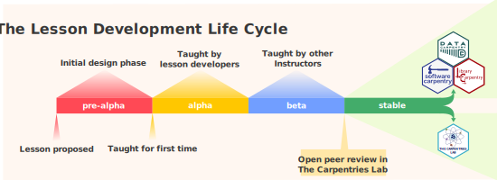

:::::::::::::::::::::::::::::::::::::: questions 

- In what ways can people contribute to a lesson?
- How should we acknowledge contributions to lessons?

::::::::::::::::::::::::::::::::::::::::::::::::

::::::::::::::::::::::::::::::::::::: objectives

- Discuss how The Carpentries and lesson authors should give credit to contributors.

::::::::::::::::::::::::::::::::::::::::::::::::

## Valuing All Contributions

- The Carpentries community is very diverse - many people who take on many different roles
- One of our core values is that we Value All Contributions
- Lesson development process provides opportunity for people to write lessons, provide feedback on them, maintain them, contribute fixes and enhancements to them, and more
- It can be difficult to capture all of this, e.g. GitHub only pays attention to commits in the list of contributors. Misses people who open or contribute to issues
- We want to better capture all of the contributions that make a lesson exist, and make that information more visible.
- With that in mind, would like to gather feedback from you all about a new page we want to introduce to lessons that use the Workbench: a Lesson Credit page.

{alt='the lesson development life cycle figure presented in an earlier episode.'}

::: instructor

the next discussion exercise will require a rough sketch of the lesson life cycle on the wall/a white board, and sticky notes for people to write on and stick to that sketch.

:::

::: discussion
## What kinds of contribution can there be?

- take a few minutes to think about the process for a stable lesson to exist, from start to finish
- who makes that happen? and when? what types of contribution are made?
- write these types of contribution on sticky notes, and stick them to the [wall/white board], roughly where they might fall in the life cycle of the lesson.
:::

- show current prototype for lesson credit page

::: challenge
## Give us your feedback

Using more sticky notes, give us feedback/your ideas on the following, according to sticky note colour:

- **pink**: what is missing from this page?
- **yellow**: who could be the target audiences for this page?
- **green**: anything else you would like to tell us

Stick your notes to the wall on your way out of the room.

:::

::::::::::::::::::::::::::::::::::::: keypoints 

- The Carpentries values all contributions.
- It can be challenging to appropriately credit all contributions made to a lesson.

::::::::::::::::::::::::::::::::::::::::::::::::

