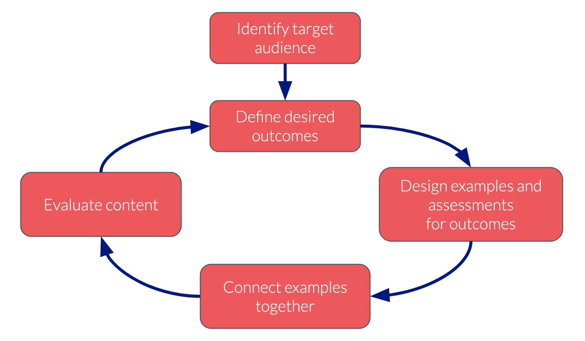
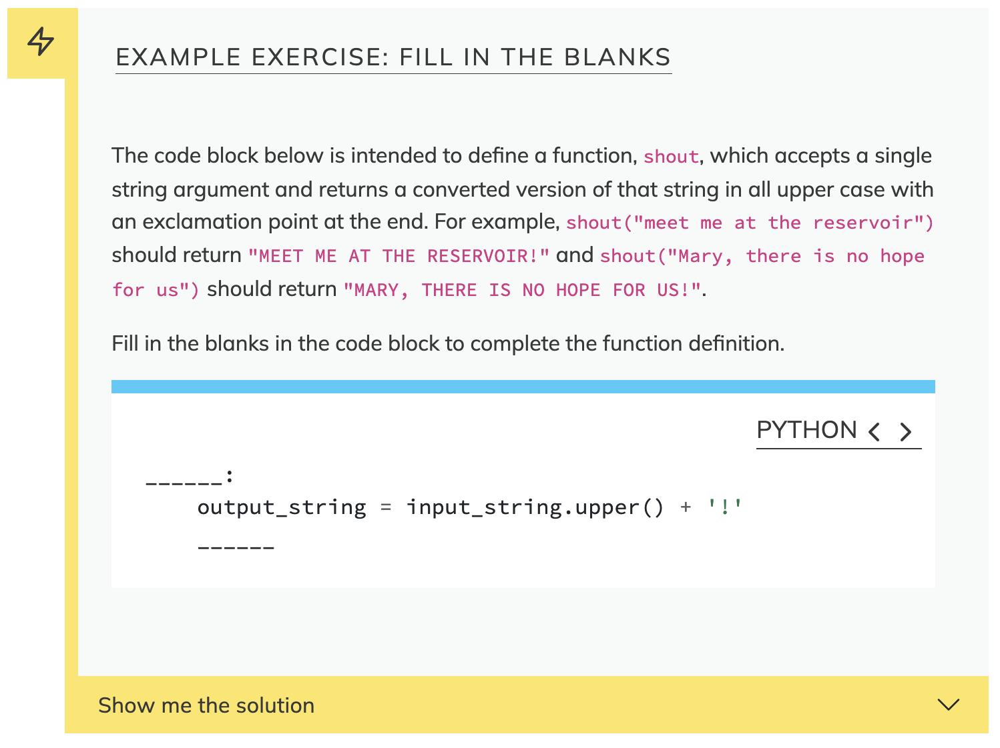
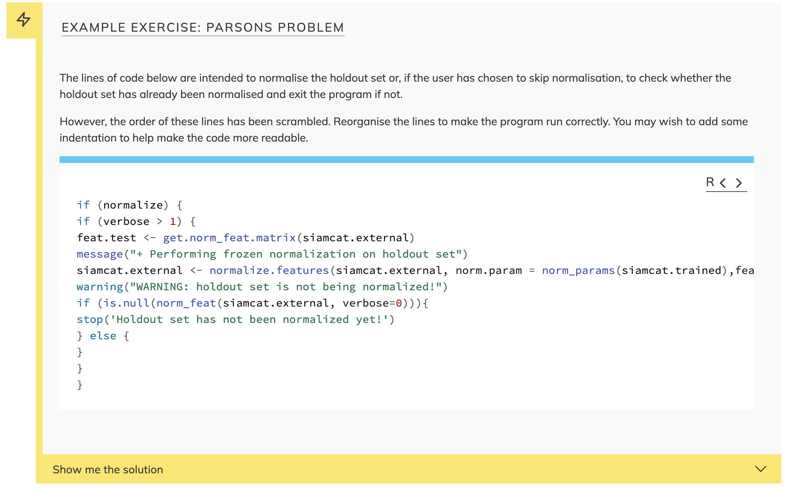
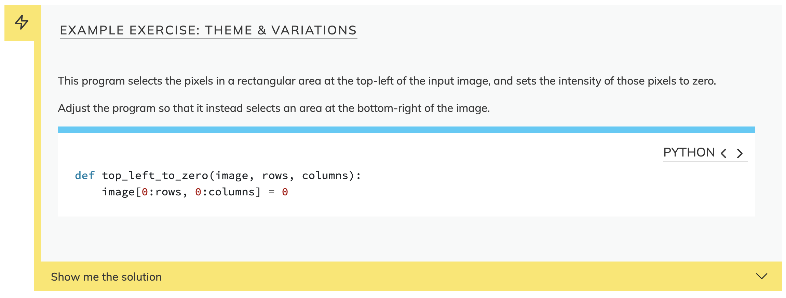

:::::::::::::::::::::::::::::::::::::: questions 

- How do I approach the design for a new lesson?
- What is backwards lesson design?
- How can I get started with lesson development in The Carpentries?

::::::::::::::::::::::::::::::::::::::::::::::::

::::::::::::::::::::::::::::::::::::: objectives

- Identify some advantages of an approach to lesson design that focuses on learner outcomes.
- Define a backwards design process for lessons.
- Find existing lesson projects in The Carpentries community.
- Propose a new lesson for development in The Carpentries Incubator.

::::::::::::::::::::::::::::::::::::::::::::::::


## Lesson Design

Training can come in many forms - from one-on-one mentoring, through semester-long modules, to massive online courses taken by thousands of people on their own schedule.

In The Carpentries, our focus is on short-format training: workshops that usually last ~2 days. It is in this context that our community develops lessons.

All training should be centered on the learners - who are they and what do they want to learn? What do you want to make sure they know how to do by the time they leave your lesson? That perspective can take a bit of getting used to: we must be prepared to forget about the things we most enjoy teaching, and try to focus instead on the things that are most important for learners to understand and be able to do.This is even more true in a short training, where we must always make compromises due to limited time in a workshop.

To help guide us in developing a lesson that will be most effective in teaching learners what we really want them to know, we try to adopt an approach to lesson design that emphasises learner outcomes. When used effectively, this approach to lesson design also helps us to identify what we can cut out if we find that we need to make space or fit the lesson into a shorter timeframe.


## Backwards Design

We recommend that lesson developers follow an iterative process 
to design, develop, and evaluate their lessons. 
Based on a paradigm described in education theory, called _Nicholl's Five Phases_,
this approach is often referred to as _backwards design_.

{alt='A schematic depicting an iterative process for lesson design. The process begins with identifying the target audience for the lesson. The remaining steps exist in a cycle, from defining desired outcomes, through designing examples and assessments to achieve these outcomes, then writing content to connect these examples together, and finally evaluating the lesson content by teaching it. After the lesson has been taught, the author can return to the define outcomes and reflect on how well they were achieved by the lesson in its current form.'}

The name backwards design reflects how the process starts by 
considering what the end of the lesson should look like:
what do we want people to have learned, or to be able to do,
by the time they leave our lesson?

When we have defined those results -
often talked about as _learning outcomes_, or _learning objectives_
(these terms have slightly different and overlapping definitions,
but we should not worry about it here) -
we work backwards to develop assessments that will test for those results,
and content that will prepare learners for to complete those assessments.

### Learning Objectives

The learning objectives or outcomes are the central elements in this:
they form the kernel around which a block of lesson content can be constructed,
and a well-definied set of learning objectives helps to guide the
development of the lesson as a whole.
It also makes it much easiert= to design exercises and activities for a lesson
that will provide meaningful feedback to the instructor and the learner
about how well learners are progressing towards the objectives,
i.e. how much they are of what you want them to learn they are actually learning.

{alt='An example leanring objective, "import data into an indexed DataFrame with read_csv", highlighting "import" as an action verb and "indexed" as making the objective more specific.'}

A well-defined learning objective should form the end of a sentence that begins
"By the end of this lesson, a learner should be able to...",
so the first word in the objective should be an action verb.
The "action" here is very important: the objective needs to be specific and measurable,
so you want to describe an observable behaviour that learners will exhibit after they
finish the lesson.

{alt='a representation of Bloom\'s Taxonomy, presenting verbs at a series of categories as levels in a triangle/pyramid. The first category is titled "remember", followed by "understand", "apply", "analyze", "evaluate", and finally "create". Each category contains examples of verbs that would fit it.'}

If you have defined such an observable objective, you can build an assessment to
test for it.

### Formative Assessment

In a short-format training, we do not usually have the option for a final exam,
or _summative assessment_, to test learners' understanding and skills after the lesson
has finished.
This makes it all the more important to include regular _formative_ assessments:
opportunities to check learners' progress towards the learning objectives
during the lesson.

Formative assessments come in many forms, but the most common is as _exercises_.
When designed well, exercises provide specific feedback to the learner and instructor,
assessing the relevant skill or concept and helping to identify misconceptions
so that they can be addressed at the earliest opportunity.

Well-defined learning objectives help us to design better exercises.
The action verb at the start of the objective can guide us towards an appropriate
exercise format.

For example, a format of exercise that can be very effective when teaching 
programming topics to novices is "fill in the blanks", where a block of code
is presented with essential parts removed. 
The intended output of the program is shown or described, and the learner is
tasked with completing the blanked out parts of the code block to achieve
this result. For example:

::: challenge
## Example Exercise: Fill in the Blanks

The code block below is intended to define a function,
`shout`, which accepts a single string argument and returns a
converted version of that string in all upper case
with an exclamation point at the end.
For example,
`shout("meet me at the reservoir")` should return `"MEET ME AT THE RESERVOIR!"`
and `shout("Mary, there is no hope for us")` should return
`"MARY, THERE IS NO HOPE FOR US!"`.

Fill in the blanks in the code block to complete the function definition.

```python
______:
    output_string = input_string.upper() + '!'
    ______
```

:::::: solution

```Python
def shout(input_string):
    output_string = input_string.upper() + '!'
    return output_string
```

::::::
:::

{alt='a screenshot of the fill-in-the-blanks example exercise written above, included for display purposes.'}

This format of exercise is best-suited to novices because it provides
a lot of scaffolding: most of the code and syntax is already in place,
and blanks should have been inserted carefully, to assess the specific
skill or concept that has just been taught.
This allows the learner to focus on this particular concept or skill,
and requires them to demonstrate their understanding when solving the problem.

A fill-in-the-blanks exercise is best suited to assessing objectives with
action verbs like "identify", "use", or "define", when linked closely to some
specific syntactic element or concept, e.g. 
"define a loop to import data from an arbitrary number of input files."

::: discussion

## More Exercise Formats

Here are three more exercise formats.
Can you suggest some action verbs these formats would be good for assessing?

**1. Parsons Problem**

This type of exercise provides all the right lines of code,
but in the wrong order and with indentation removed.


**2. Theme & Variations**

This type of exercise provides some example code and instructs
the learner to adapt that to a new purpose.


**3. Minimal Fix**

This type of exercise presents some broken code and the desired result,
and asks the learner to make the smallest possible change to fix the program.

:::

::: challenge
## Example Exercise: Parsons Problem
The lines of code below are intended to normalise the holdout set or,
if the user has chosen to skip normalisation,
to check whether the holdout set has already been normalised and exit the
program if not.

However, the order of these lines has been scrambled.
Reorganise the lines to make the program run correctly.
You may wish to add some indentation to help make the code more readable.

```R
if (normalize) {
if (verbose > 1) {
feat.test <- get.norm_feat.matrix(siamcat.external)
message("+ Performing frozen normalization on holdout set")
siamcat.external <- normalize.features(siamcat.external, norm.param = norm_params(siamcat.trained),feature.type='original', verbose = verbose)
warning("WARNING: holdout set is not being normalized!")
if (is.null(norm_feat(siamcat.external, verbose=0))){
stop('Holdout set has not been normalized yet!')
} else {
}
}
}

```

:::::: solution

```R
if (normalize) {
    if (verbose > 1) {
        message("+ Performing frozen normalization on holdout set")
    }
    siamcat.external <- normalize.features(
        siamcat.external, norm.param = norm_params(siamcat.trained),
        feature.type='original', verbose = verbose)
} else {
    warning("WARNING: holdout set is not being normalized!")
    if (is.null(norm_feat(siamcat.external, verbose=0))){
        stop('Holdout set has not been normalized yet!')
    }
}
```

::::::

:::

{alt='a screenshot of the parsons problem example exercise written above, included for display purposes.'}

::: challenge
## Example Exercise: Theme & Variations
This program selects the pixels in a rectangular area at the top-left
of the input image, and sets the intensity of those pixels to zero.

Adjust the program so that it instead selects an area at the
bottom-right of the image.

```python
def top_left_to_zero(image, rows, columns):
    image[0:rows, 0:columns] = 0
```

:::::: solution

```python
def bottom_right_to_zero(image, rows, columns):
    image[image.shape[0]-rows:image.shape[0], image.shape[1]-columns:image.shape[1]] = 0
```

::::::

:::

{alt='a screenshot of the theme and variations example exercise written above, included for display purposes.'}

::: challenge
## Example Exercise: Minimal Fix
This function is supposed to test whether a number lies within a range. 
Make one small change so that it actually does so.

```python
def inside(point, lower, higher):
    if (point <= lower):
        return False
    elif (point <= higher):
        return False
    else:
        return True
```

(This example taken from Greg Wilson's _Teaching Tech Together_.)

:::::: solution

```python
def inside(point, lower, higher):
    if (point <= lower):
        return False
    elif (point >= higher):
        return False
    else:
        return True
```

::::::

:::

{alt='a screenshot of the minimal fix example exercise written above, included for display purposes.'}

:::::: instructor

1. parsons problem - "construct", "define", "arrange", "organise", "trace"
2. theme & variations - "trace", "identify", "find", "choose", "design"
3. minimal fix - "debug", "diagnose", "identify", "choose", "find", "fix"

::::::


For more ideas about exercise formats, read 
[the _Exercise Types_ chapter of _Teaching Tech Together_ by Greg Wilson][ttt-exercises].

## Collaborative Lesson Development Training

{alt=''}

We have begun teaching all of this in a lot more detail in a new program of
[Collaborative Lesson Development Training][cldt]. 
If you are planning to begin developing a new lesson,
and especially if you are interested in doing so using the
open source infrastructure we are presenting in this workshop,
I recommend you look out for this training.


## The Carpentries Incubator

{alt='' style='width:"20%"; padding:10px'}

In The Carpentries Incubator, we provide support for collaborative lesson development,
including:

- Collaborative Lesson Development Training
- Templates for lesson repositories, feedback surveys and notes from pilot workshops, and communications
- Help with communication about a lesson project & networking to build a community of contributors around a lesson
- Building a community of practice around lesson development - collaborate with others and re-use lessons
- Infrastructure (the rest of this workshop)

If you would like to find out about the lessons that are already under development in
the Incubator, visit our [Community Lessons listing][community-lessons].
To propose a new lesson for the Incubator, 
head to our [Proposals repository][incubator-proposals],
open a new issue, and answer the questions in the issue template.

To find out more about the Incubator and 
the pathway that a new lesson can take through it and out the other side,
find our poster at the conference.


## How can RSEs Help?

Research Software Engineers are more aware than most people about the skills
that researchers and RSEs need, and upcoming developments that they should prepare for.
This makes you well-placed to identify topics for lessons that could be developed.
Indeed, RSEs often have teaching responsibilities, or choose to teach as an effective
means of increasing capacity and the quality of research at their institutes.

RSEs can help The Carpentries with our mission by
contributing to existing lessons and developing new ones
that teach the skills you know people need to learn.
As well as writing new lessons,
you can provide valuable feedback to lesson developers
by teaching their lessons and sharing your experience,
and even by volunteering to peer review lessons
in [The Carpentries Lab][lab] -
again, come see our poster for more information on that!


::::::::::::::::::::::::::::::::::::: keypoints 

- When designing a new lesson, we recommend starting by identifying your target audience, thinking about what they already know, and what you want them to be able to do by the end of the lesson.
- Backwards lesson design is an iterative process for lesson design and development that focuses on the desirable, observable behaviours the lesson should teach to learners.
- Lessons are being developed in The Carpentries Incubator. You can go there to find an existing lesson to contribute to, or to propose a new lesson of your own.

::::::::::::::::::::::::::::::::::::::::::::::::

